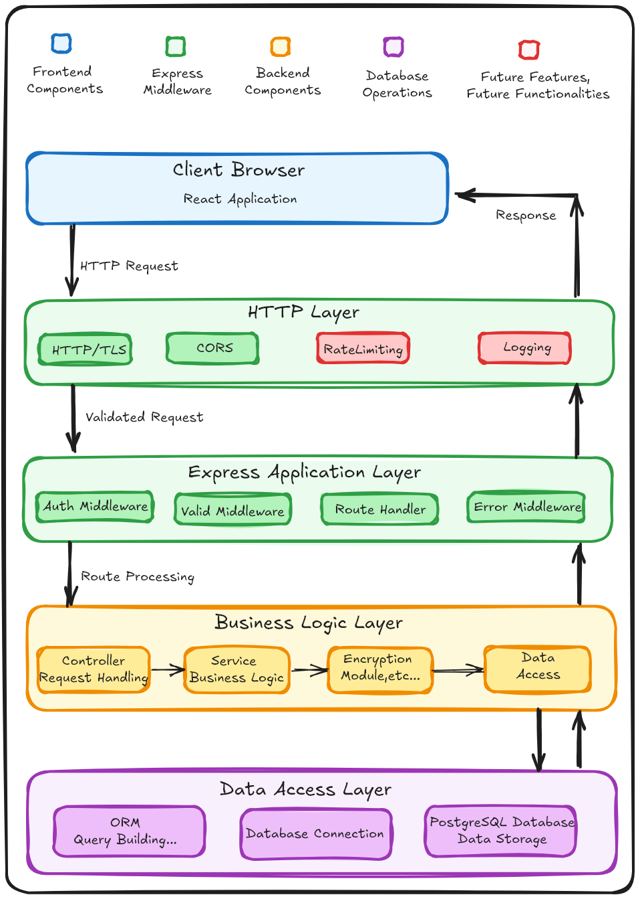

# Secure Password Manager

A robust, secure password management system with end-to-end encryption and zero-knowledge architecture.

## 🔒 System Architecture

### Project Structure

### Backend
```
password-manager-backend/
├── src/
│   ├── config/         # Configuration files
│   ├── controllers/    # Request handlers
│   ├── middleware/     # Express middleware
│   ├── models/         # Data models
│   ├── routes/         # API routes
│   ├── services/       # Business logic
│   ├── utils/          # Utility functions
│   └── app.js          # Express application setup
│
├── migrations/         # Database migration scripts
├── tests/              # Test suites
└── [configuration files]
```

## 📊 System Architecture Diagram


## Frontend (React)
The frontend is built using **React** and includes the following components:
- **UI Components**: Built with Tailwind CSS and Material-UI for a modern and responsive user interface.
- **Auth Provider**: Handles authentication and manages user sessions.
- **API Service**: Facilitates communication between the frontend and backend via HTTP requests.
- **Local Storage Service**: Stores user-related data securely in the browser.

## Backend (Node.js + Express)
The backend is implemented using **Node.js** with **Express.js** and consists of the following modules:
- **API Routes**: Handles requests related to authentication (`/auth`) and password management (`/password`).
- **Middlewares**: Includes authentication middleware and request validation for security and data integrity.
- **Services**: Business logic is divided into:
  - `UserService` for managing user-related operations.
  - `PasswordService` for handling secure password storage and retrieval.
- **Encryption Module**: Ensures that sensitive data is encrypted before being stored.

## Database (PostgreSQL)
The database layer utilizes **PostgreSQL**, with the following structure:
- **Tables**:
  - `UsersTable`: Stores user account information.
  - `PasswordsTable`: Securely stores encrypted user passwords.
- **Database Management**:
  - Manages connections efficiently.
  - Handles queries and data transactions securely.

### System Flow
1. **User Interaction**: The React frontend sends requests to the backend.
2. **Processing**: The backend validates, processes, and executes business logic.
3. **Data Storage**: The PostgreSQL database securely stores and retrieves information.
4. **Security**: Authentication, encryption, and middleware ensure data protection.

This architecture ensures a secure, scalable, and maintainable password management system.


## 🔄 Request Flow Pipeline


## Client Initiation Layer
- User interactions begin in the **React frontend**.
- Frontend validates inputs and builds HTTP requests.
- **JWT authentication token** is attached to requests for protected routes.

## HTTP Security Layer
- **HTTPS/TLS**: Ensures encrypted data transmission.
- **CORS Middleware**: Controls which domains can access your API.
- **Rate Limiter**: Protects against brute force attacks by limiting login attempts.
- **Logger**: Records request details for monitoring and debugging.

## Express Application Layer
- **Auth Middleware**: Validates JWT tokens and extracts encryption keys.
- **Validation Middleware**: Ensures request data meets schema requirements.
- **Route Handler**: Directs requests to appropriate controllers.
- **Error Middleware**: Provides consistent error handling.

## Business Logic Layer
- **Controllers**: Coordinate the request/response cycle.
- **Services**: Implement core application logic and business rules.
- **Security Components**: Handle authentication and encryption operations.
- **Models**: Define data structures and validation rules.

## Data Access Layer
- **ORM Layer**: Translates JavaScript operations to database queries.
- **Connection Pool**: Efficiently manages database connections.
- **Database**: Persists encrypted data securely.


## Features

### 1. Zero-Knowledge Architecture
- **Master Password**: Hash stored, only used to derive encryption keys
- **Client-Side Key Derivation**: Encryption key derived from master password
- **Server-Side Security**: No access to plaintext passwords
- **Global Exception** Handling any exception within the application
- **Validation Middleware** To short circuit the pipleline and write response

### 2. Data Protection
- **AES-256-CBC Encryption**: Industry-standard encryption for all stored passwords
- **Unique IVs**: Each password uses a unique initialization vector
- **Key Management**: Encryption keys transmitted securely via JWT
- **Password Hashing**: bcrypt with high work factor for master password

### 3. Application Security
- **Rate Limiting**: Prevents brute force attacks
  - Login: Certain Number of  attempts per minute per IP
  - Password operations: Certain Number of per minute per user
- **Input Validation**: Comprehensive request validation
- **Request Filtering**: Rate limiting and validation before processing
- **CORS Protection**: Restricts API access to allowed domains
- **SQL Injection Protection**: ORM parameterization
- **JWT Configuration**: Short-lived tokens (1 hour expiration)

## 🚀 Getting Started

### Prerequisites
- Node.js 14.x or later
- PostgreSQL 12.x or later
- npm or yarn

### Installation
1. Clone the repository
2. Install dependencies
   ```
   npm install
   ```
3. Set up environment variables (copy from .env.example)
4. Run database migrations
   ```
   npm run migrate
   ```
5. Start the development server
   ```
   npm run dev
   ```

## 📚 API Documentation

### Authentication Endpoints
- `POST /api/auth/register` - Create new user account
- `POST /api/auth/login` - Login and receive JWT

### Password Endpoints
- `GET /api/passwords` - Retrieve all passwords
- `POST /api/passwords` - Create new password entry
- `PUT /api/passwords/:id` - Update existing password
- `DELETE /api/passwords/:id` - Delete password entry

## 🧪 Testing

```
npm run test         # Run all tests
npm run test:unit    # Run unit tests only
npm run test:integration # Run integration tests only
```

